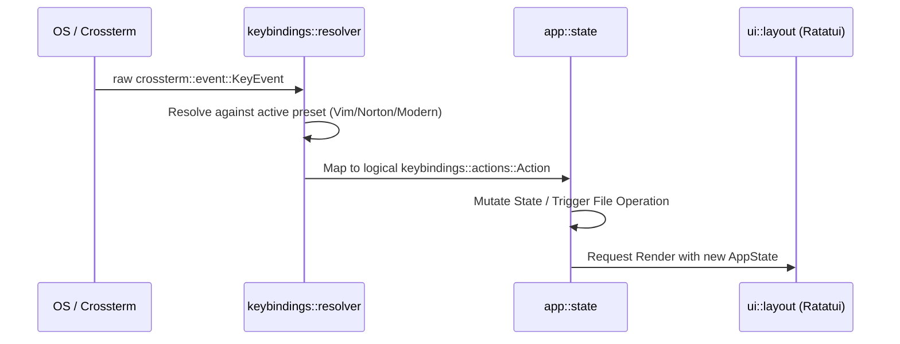
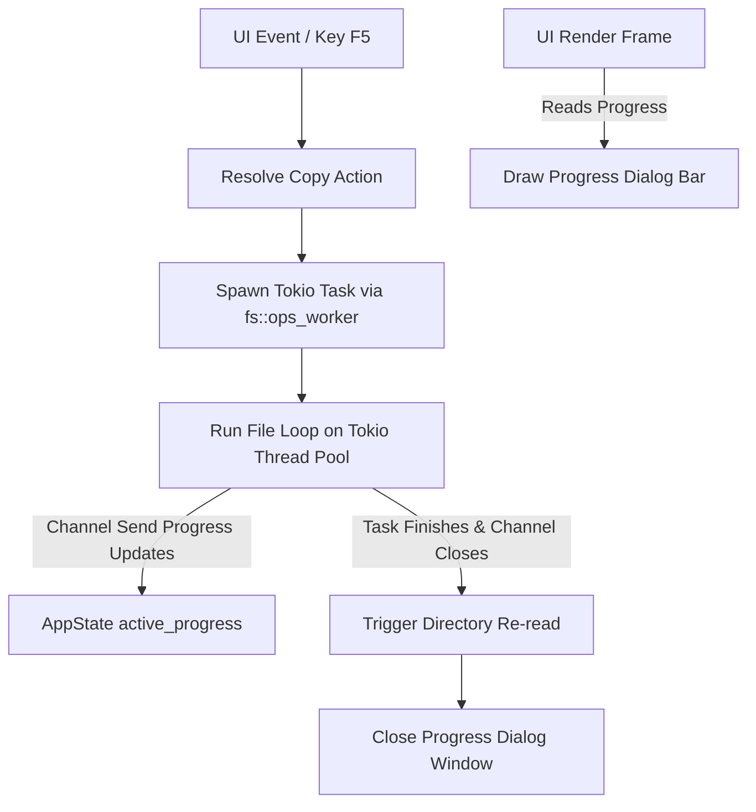

# NCRust Technical Architecture

This document describes the software design, folder organization, and coding patterns applied in **NCRust**.

---

## 🏗️ Design Principles

NCRust is engineered with a strict modular design to ensure high testability, separation of concerns, and ease of maintenance.

### 1. Separation of Core and UI (Decoupled State)
The core application state, filesystem utilities, configuration profiles, and logger files operate independently of the UI drawing engine (`ratatui`).
* **Why:** This decoupling allows unit testing state transitions, navigation logic, and sorting collations without spinning up or mocking a terminal interface.
* **Flow:** The main event loop receives events, triggers actions to mutate the `AppState` or `AppContext`, and then passes the state to the UI layout engine to be rendered.

### 2. Keybinding Resolution Pattern
NCRust avoids hardcoding key mappings inside UI elements or matching raw crossterm events in the presentation layer. Keyboard events flow in a single direction:

---

## 🔄 Async Background Task Pattern

Long-running file system operations (like Copy, Move, Wipe, Delete) are processed asynchronously to ensure the terminal rendering remains fluid and does not block the UI.

### Flow Details
1. **Initiate:** The application main thread spawns a Tokio task (`fs::ops_worker::spawn_copy_task`).
2. **Progress Channel:** The background worker reports real-time progress (percentage completed, current file name, processed bytes) through a crossbeam/tokio channel.
3. **Rendering:** During each draw cycle, the main UI thread reads the progress metrics stored in `AppState` and renders a modern progress dialog.
4. **Completion:** Once the background task completes, the channel closes. The application triggers a directory refresh on both panels and closes the popup dialog.

---

## 📦 Directory Structure & Responsibilities

The codebase is structured under the following logical components:

* **`src/main.rs`**: The main entry point. Sets up the standalone terminal checks, initializes config files, sets up debug logging to file, builds contexts, and spawns the app runner.
* **`src/app/`**: Handles the primary event loops and state containers.
  * **`state/`**: Manages panel focus, list index, glob filtering, active operations, and progress channels.
  * **`actions/`**: Defines logical actions (e.g., executing system commands, modifying layout, navigating directories).
* **`src/config/`**: Manages configuration settings, theme files parsing, and translation tables.
  * **`localization/`**: Contains centralized string databases (like default English in `en.rs`).
* **`src/keybindings/`**: Contains the resolver mapping user events into structural action items.
* **`src/fs/`**: Handles physical filesystem reads, sorting, folder comparison logic, and background copy task runners.
* **`src/ui/`**: Pure rendering layer. Uses `ratatui` widgets to draw panels, dropdown menus, the command line prompt, hotkeys help bars, and interactive config setting forms.
* **`src/terminal/`**: Controls raw mode setup/restore, terminal sizing, and handles the standalone launcher wrapper checks.

---

## 🎨 Theme & Styling Conversion

Theme files are configured using TOML formats. The module `ui::theme_apply` converts raw CSS-like theme colors from the configuration into concrete `ratatui::style::Style` configurations. 
This allows switching visual modes (Slate, Blue, High Contrast) on the fly without changing logic blocks.
