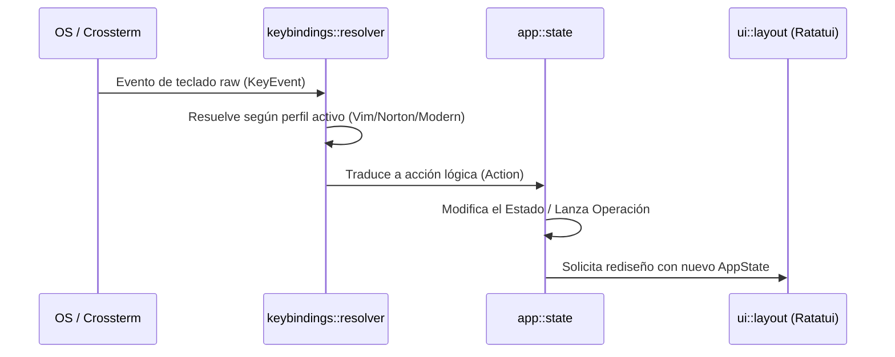
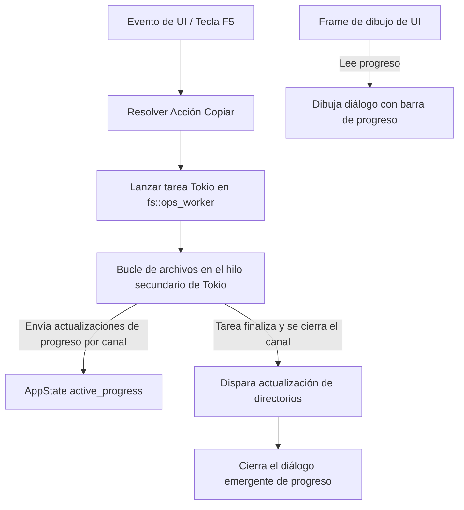

# Arquitectura Técnica de NCRust

Este documento describe el diseño de software, la organización de carpetas y los patrones de desarrollo aplicados en **NCRust**.

---

## 🏗️ Principios de Diseño

NCRust está diseñado bajo una estructura estrictamente modular para garantizar la máxima facilidad de pruebas, separación de conceptos y mantenimiento a largo plazo.

### 1. Separación de Core y UI (Estado Desacoplado)
El estado de la aplicación, las funciones de acceso al disco, los perfiles de configuración y los registros de depuración operan de forma independiente al motor de dibujo de la interfaz (`ratatui`).
* **Por qué:** Este desacoplamiento nos permite probar mediante pruebas unitarias las transiciones de estado, la lógica de navegación y los ordenamientos sin necesidad de simular o arrancar la interfaz de terminal.
* **Flujo:** El bucle de eventos principal recibe las entradas del teclado, ejecuta la acción para modificar `AppState` o `AppContext`, y luego le entrega el estado actual al motor de renderizado de la interfaz para dibujarlo.

### 2. Patrón de Resolución de Atajos de Teclado
NCRust evita mapear teclas directamente en los elementos de la interfaz. Los eventos de crossterm fluyen en un único sentido:

---

## 🔄 Patrón de Tareas en Segundo Plano Asíncronas

Las operaciones del sistema de archivos que requieren mucho tiempo (Copiar, Mover, Borrado Seguro, Eliminar) se procesan asíncronamente para evitar que la interfaz de usuario se congele.

### Detalles del Flujo
1. **Inicio:** El hilo principal de la aplicación inicia una tarea asíncrona de Tokio (`fs::ops_worker::spawn_copy_task`).
2. **Canal de Progreso:** La tarea en segundo plano reporta en tiempo real el progreso (porcentaje completado, archivo actual, bytes procesados) a través de un canal de comunicación asíncrono (crossbeam/tokio).
3. **Renderizado:** En cada ciclo de dibujado, la interfaz lee estos datos desde el `AppState` y renderiza un cuadro de diálogo con la barra de progreso activa.
4. **Finalización:** Una vez completada la tarea, el canal se cierra. La aplicación fuerza la actualización de los paneles y cierra automáticamente la ventana emergente de progreso.

---

## 📦 Estructura del Directorio y Responsabilidades

El código fuente está organizado en los siguientes módulos:

* **`src/main.rs`**: Punto de entrada. Ejecuta las validaciones de arranque de ventana dedicada, inicializa los archivos de configuración, activa el registro de depuración en archivo, genera los contextos e inicia el bucle de ejecución.
* **`src/app/`**: Gestiona los bucles de eventos y los contenedores de estado principales.
  * **`state/`**: Controla el foco de paneles, índices de selección, filtros glob, operaciones activas y canales de progreso.
  * **`actions/`**: Define acciones lógicas (ej. ejecutar comandos del sistema, cambiar diseños, navegar directorios).
* **`src/config/`**: Administra los perfiles TOML, parseadores de temas y tablas de traducción.
  * **`localization/`**: Contiene la base de datos de traducciones (ej. inglés en `en.rs`).
* **`src/keybindings/`**: Contiene el motor que traduce los eventos de teclas físicas en acciones estructuradas de la aplicación.
* **`src/fs/`**: Operaciones físicas en disco, ordenamiento, comparación de directorios y tareas asíncronas de copiado.
* **`src/ui/`**: Capa de representación visual pura. Utiliza `ratatui` para renderizar los paneles, menús, consola de entrada, barras de teclas F y cuadros de diálogo.
* **`src/terminal/`**: Gestiona el modo raw de la consola, su redimensionamiento y los lanzadores de ventanas de consola independientes.

---

## 🎨 Conversión de Temas Visuales

Los archivos de temas visuales se configuran en formato TOML. El módulo `ui::theme_apply` convierte los colores de texto y fondos de la configuración en estilos nativos de `ratatui::style::Style`, permitiendo cambiar el tema visual (Slate, Blue, High Contrast) en caliente sin alterar la lógica de renderizado.
