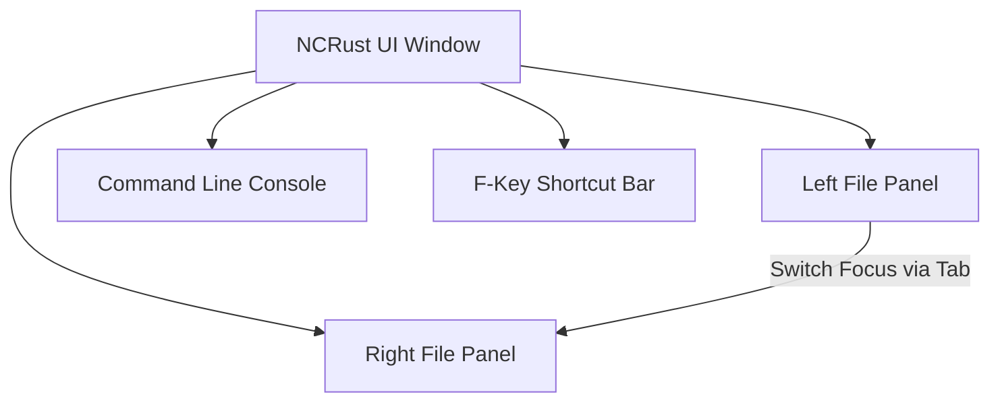

# NCRust Features Manual

This document provides a comprehensive guide to all interactive and background features implemented in **NCRust**.

---

## 🖥️ Panel Management & Navigation

NCRust operates primarily through a dual-panel layout, mirroring traditional file managers to optimize navigation and execution speed.

### 1. Panel Views & Custom Columns
You can toggle between different layouts for the active panel, depending on how much file metadata you want to display:
* **Brief:** Displays names only across multiple columns for maximum file density.
* **Medium:** Displays names and file extensions.
* **Full / Detailed:** Comprehensive details including Name, Size, Date Modified, Extensions, Permissions (Unix-style octal), Owner, and Link counts.
* **Wide:** Enhanced name column spacing with details.

### 2. File Sorting Collation
Files can be sorted dynamically using the Options menu or Ctrl hotkeys:
* **Sorting Fields:** Name, Extension, Size, Date Modified, Unsorted.
* **Collation Settings:** Supports natural/linguistic collation (sorting `file2` before `file10` by treating digits as numbers) and case-sensitive sorting.
* **Reverse Sort:** Toggle sorting direction on the fly.

### 3. File Highlighting & Hidden Files
* **Visual Colors:** Files are color-coded depending on extension/rules (e.g., green for executables, red for archives).
* **Toggle Hidden Files:** Instantly show or hide dotfiles (files starting with `.`) or system-hidden files via `Ctrl+H`.

---

## 📂 File System Operations

File system operations are designed to be fast, safe, and fully asynchronous to prevent freezing the UI.

| Operation | Trigger | Mode | Details |
| :--- | :--- | :--- | :--- |
| **Bulk Selection** | `Insert` / `Space` | Synchronous | Tags files for bulk operations. Displays total tagged counts at the status bar. |
| **Copy** | `F5` | Asynchronous | Spawns a Tokio task. Copies selected files to the passive panel with real-time status. |
| **Rename/Move** | `F6` | Asynchronous | Moves files. Performs cross-device rename/move efficiently. |
| **Make Directory**| `F7` | Synchronous | Simple prompt window to create single or nested paths. |
| **Delete** | `F8` | Asynchronous | Deletes files/folders. Can be configured to delete to Recycle Bin. |
| **Secure Wipe** | Options Menu | Asynchronous | Securely overwrites files with zeroes or random bytes before deletion (irrecoverable). |

> [!WARNING]
> **Secure Wipe** is destructive and cannot be undone. Always review the confirmation prompt before proceeding.

---

## 🛠️ Integrated Terminal & Command Execution

NCRust features an integrated Command Line Block at the bottom of the screen:
* **Direct Execution:** Type any shell command and hit `Enter` to run it in the current panel's directory.
* **Command Templates:** Execute bulk commands using `%f` placeholders (substitutes selected file names dynamically).
* **Command History:** View and navigate the historical record of executed terminal commands using `Alt+F8`.

---

## 🧰 Utilities & Advanced Tools

### 1. Folder Compare
* Compares the left and right panel contents.
* Detects differences in file size or modification timestamps.
* Automatically highlights and tags mismatched files so you can sync them with a single copy/move action.

### 2. OS Task & Process Manager
* Displays a list of currently running processes on the system (PIDs, process names, memory usage).
* Allows you to terminate/kill selected processes directly using `Delete` or `Alt+Delete` within the UI.

### 3. Directory Hotlist
* Quick navigation bookmarks (`Ctrl+\` or via menu) to jump instantly to frequently accessed directories.

### 4. Custom User Commands Menu
* Define shortcut actions and run custom shell/scripts on selected items inside the panel.

---

## 🔍 Search, Viewer, & Editor

### 1. Advanced Search
* Search files recursively by name wildcard pattern (e.g., `*.rs`, `target*`).
* Search inside file contents for matching string queries.
* Jump to any searched file directly from the search results dialog.

### 2. Internal File Viewer (F3)
* Open files in read-only mode to view their contents.
* **Modes:** Toggle between plain Text mode and Hex Dump view mode (perfect for binary inspection).
* Integrated text search inside the viewer.

### 3. Internal Editor (F4)
* A simple editor to modify files in-place.
* Includes status counters (Line/Col, character counts) and handles dirty state warnings when attempting to exit without saving.
