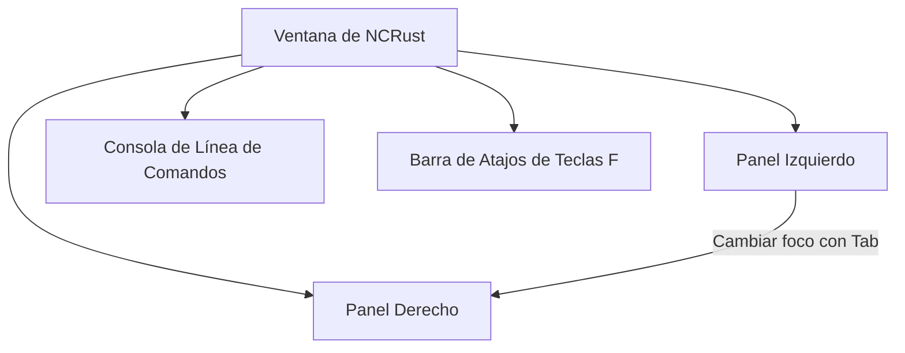

# Manual de Funciones de NCRust

Este documento proporciona una guía detallada de todas las funciones interactivas y de segundo plano implementadas en **NCRust**.

---

## 🖥️ Gestión de Paneles y Navegación

NCRust opera principalmente a través de un diseño de doble panel, emulando los administradores de archivos tradicionales para optimizar la velocidad de navegación.

### 1. Vistas de Paneles y Columnas Personalizadas
Puedes alternar entre diferentes diseños para el panel activo, dependiendo del nivel de detalle que desees ver:
* **Brief (Breve):** Muestra solo nombres en múltiples columnas para maximizar la cantidad de archivos visibles.
* **Medium (Medio):** Muestra nombres y extensiones.
* **Full / Detailed (Detallado):** Detalles completos que incluyen Nombre, Tamaño, Fecha de Modificación, Extensión, Permisos (en formato octal Unix), Propietario y número de enlaces.
* **Wide (Ancho):** Espaciado ampliado de nombres con detalles secundarios.

### 2. Clasificación y Ordenamiento de Archivos
Los archivos se pueden ordenar de forma dinámica usando el menú de Opciones o atajos con la tecla Ctrl:
* **Campos de Ordenación:** Nombre, Extensión, Tamaño, Fecha de modificación, Desordenado (Unsorted).
* **Cotejo (Collation):** Admite ordenamiento natural/lingüístico (ordenar `archivo2` antes que `archivo10` al tratar dígitos como números) y ordenamiento sensible a mayúsculas y minúsculas.
* **Orden Inverso:** Invierte la dirección del orden (ascendente/descendiente) al instante.

### 3. Resaltado de Archivos y Archivos Ocultos
* **Colores Visuales:** Los archivos se colorean según sus extensiones o reglas (por ejemplo, verde para ejecutables, rojo para archivos comprimidos).
* **Alternar Ocultos:** Muestra u oculta archivos de sistema y archivos de configuración (archivos que empiezan con `.`) al instante mediante `Ctrl+H`.

---

## 📂 Operaciones del Sistema de Archivos

Las operaciones de disco están diseñadas para ser rápidas, seguras y completamente asíncronas para evitar bloqueos en la interfaz.

| Operación | Atajo | Modo | Detalles |
| :--- | :--- | :--- | :--- |
| **Selección Múltiple** | `Insert` / `Espacio` | Síncrono | Marca archivos para operaciones en lote. Muestra el conteo de elementos marcados en la barra de estado. |
| **Copiar** | `F5` | Asíncrono | Genera una tarea de Tokio. Copia los archivos seleccionados al panel pasivo con barras de progreso en tiempo real. |
| **Renombrar/Mover** | `F6` | Asíncrono | Mueve archivos. Gestiona renombrados y traslados entre distintos discos eficientemente. |
| **Crear Carpeta**| `F7` | Síncrono | Muestra un cuadro de diálogo simple para crear directorios. |
| **Eliminar** | `F8` | Asíncrono | Elimina archivos/carpetas. Puede configurarse para enviar a la Papelera de Reciclaje. |
| **Borrado Seguro (Wipe)**| Menú Opciones | Asíncrono | Sobrescribe de forma segura los archivos con ceros o bytes aleatorios antes de borrarlos (irreversible). |

> [!WARNING]
> El **Borrado Seguro (Wipe)** es destructivo e irreversible. Revisa siempre la advertencia de confirmación antes de proceder.

---

## 🛠️ Terminal Integrada y Ejecución de Comandos

NCRust incluye una sección de Línea de Comandos en la parte inferior:
* **Ejecución Directa:** Escribe cualquier comando del sistema y pulsa `Enter` para ejecutarlo en el directorio del panel activo.
* **Plantillas de Comandos:** Ejecuta comandos masivos usando marcadores `%f` (reemplaza los nombres de los archivos seleccionados de forma dinámica).
* **Historial de Comandos:** Visualiza y navega el registro de comandos ejecutados anteriormente mediante `Alt+F8`.

---

## 🧰 Utilidades y Herramientas Avanzadas

### 1. Comparar Carpetas
* Compara el contenido de los paneles izquierdo y derecho.
* Detecta diferencias de tamaño o fecha de modificación.
* Marca automáticamente los archivos diferentes en el panel activo para que puedas sincronizarlos fácilmente copiándolos o moviéndolos.

### 2. Administrador de Procesos
* Muestra la lista de procesos activos del sistema (PIDs, nombre, consumo de memoria).
* Permite finalizar/matar procesos seleccionados con `Supr` o `Alt+Supr` desde la interfaz.

### 3. Lista de Favoritos (Directory Hotlist)
* Marcadores rápidos (`Ctrl+\` o desde el menú) para saltar de inmediato a tus rutas frecuentes.

### 4. Menú de Comandos del Usuario
* Define accesos rápidos para ejecutar scripts o comandos personalizados sobre los archivos seleccionados.

---

## 🔍 Búsqueda, Visor y Editor

### 1. Búsqueda Avanzada
* Busca archivos recursivamente con filtros por nombre (ej. `*.rs`, `target*`).
* Busca dentro del contenido de los archivos buscando coincidencias de texto.
* Salta directamente al archivo seleccionado desde la lista de resultados.

### 2. Visor Interno (F3)
* Abre archivos en modo de lectura para inspeccionar su contenido.
* **Modos:** Alterna entre modo Texto normal y modo Hexadecimal (perfecto para archivos binarios).
* Búsqueda de texto integrada dentro del visor.

### 3. Editor Interno (F4)
* Un editor básico para modificar archivos in-situ.
* Incluye indicadores de posición (Línea/Columna, caracteres) y advertencias de cambios sin guardar al salir.
